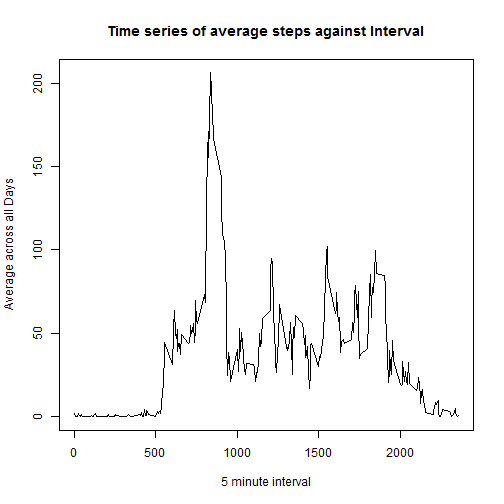

##Loading and preprocessing the data


```r
library (lattice)
```

```
## Warning: package 'lattice' was built under R version 3.1.3
```

```r
activityDataSet <- read.csv("activity.csv")
```

##What is mean total number of steps taken per day?

* A histogram of the total number of steps taken each day


```r
stepSum <- aggregate(activityDataSet$steps, list(activityDataSet$date), sum, na.rm=TRUE)
hist(stepSum$x, main = "Histogram of total steps per day", xlab = "Total number of steps", breaks = 13)
```

 

* The mean and median total number of steps taken per day

```r
stepMean <- mean(stepSum$x)
```
####The mean number of steps taken per day is 9354.2295082


```r
stepMedian <- median(stepSum$x)
```
####The median number of steps taken per day is  10395

## What is the average daily activity pattern?


```r
intervalSteps <- aggregate(
  data=activityDataSet,
  steps~interval,
  FUN=mean,
  na.action=na.omit
  )
colnames(intervalSteps) <- c("Interval", "AvgStepsAcrossDay")

with(intervalSteps, {
    plot(
      x=Interval,
      y=AvgStepsAcrossDay,
      type="l",
      main="Time series of average steps against Interval",
      xlab="5 minute interval",
      ylab="Average across all Days"

    )
})
```

 

```r
intervalMax <- intervalSteps[intervalSteps$AvgStepsAcrossDay == max(intervalSteps$AvgStepsAcrossDay), ]
```

####The interval 835 has the maximum number of steps.

##Imputing missing values


```r
totalNumberNA <- sum(is.na(activityDataSet$steps))
```
####The total number of missing values in the dataset is 2304.

* A histogram of the total number of steps taken each day with NA


```r
stepValues <- data.frame(activityDataSet$steps)
stepValues[is.na(stepValues), ] <- ceiling(tapply(X=activityDataSet$steps, INDEX = activityDataSet$interval, FUN=mean, na.rm=TRUE))
newDataSet <- cbind(stepValues, activityDataSet[,2:3])
colnames(newDataSet) <- c("Steps", "Date", "Interval")

newStepSum <- aggregate(newDataSet$Steps, list(newDataSet$Date), sum)
hist(newStepSum$x, main = "Histogram of total steps per day", xlab = "Total number of steps", breaks = 13)
```

 

* The mean and median total number of steps taken per day

```r
newStepMean <- mean(newStepSum$x)
newStepMean
```

```
## [1] 10784.92
```


```r
newStepMedian <- median(newStepSum$x)
newStepMedian
```

```
## [1] 10909
```

##Are there differences in activity patterns between weekdays and weekends?


```r
dateDayType <- data.frame(
  sapply(X = newDataSet$Date, FUN = function(day) {
    if (weekdays(as.Date(day)) %in% c("Monday", "Tuesday", "Wednesday",
                                        "Thursday", "Friday")) {
      day <- "weekday"
    } else {
      day <- "weekend"
    }
}))
newDataSetDayType <- cbind(newDataSet, dateDayType)
colnames(newDataSetDayType) <- c("Steps", "Date", "Interval", "DayType")

dayTypeInterval <- aggregate(data = newDataSetDayType, Steps ~ DayType + Interval, FUN=mean)

xyplot(
    type="l",
    data = dayTypeInterval,
    Steps ~ Interval | DayType,
    xlab = "Interval",
    ylab = "Number of steps",
    layout = c(1,2)
)
```

 
